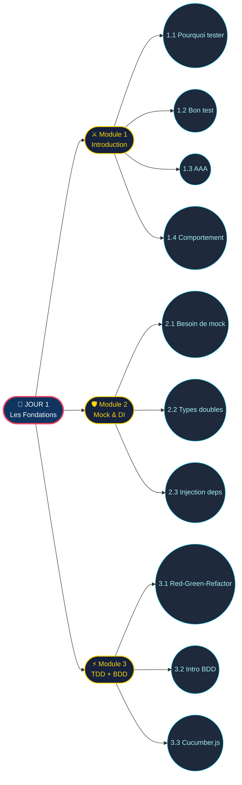
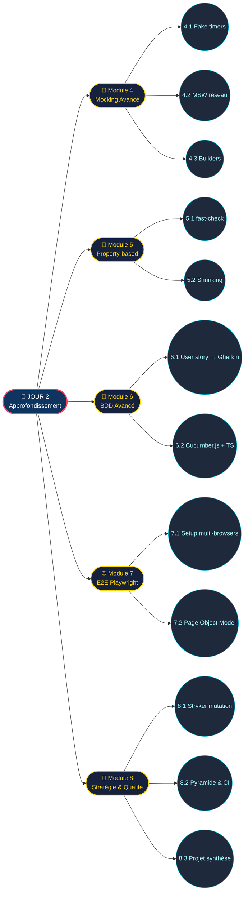
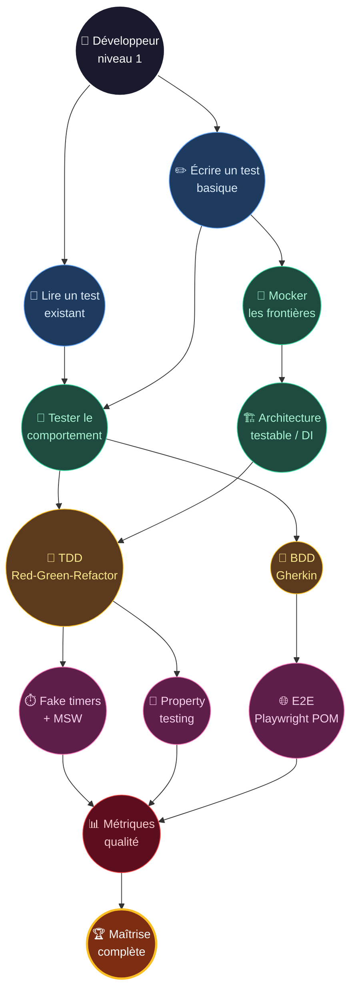

# 🗺️ Carte des Quêtes — Formation Tests Unitaires

> Progression sur 2 jours dans l'univers Hawkins Lab Escape

---

## Vue d'ensemble (parcours complet)

```mermaid
flowchart TD
    START(["🎮 Start<br/>Hawkins Lab Escape"]):::start

    %% === ACTE I : JOUR 1 ===
    START --> ACT1{{"🌅 ACTE I — JOUR 1<br/>Les Fondations"}}:::act

    ACT1 --> Q1(["⚔️ Quête I<br/>Introduction au Testing"]):::mainquest
    Q1 --> Q1A(("Pourquoi tester ?")):::sub
    Q1 --> Q1B(("Anatomie<br/>d'un bon test")):::sub
    Q1 --> Q1C(("AAA<br/>Arrange Act Assert")):::sub
    Q1 --> Q1D(("Comportement<br/>vs implémentation")):::sub

    Q1 --> Q2(["🛡️ Quête II<br/>Mock & Architecture"]):::mainquest
    Q2 --> Q2A(("Pourquoi<br/>mocker ?")):::sub
    Q2 --> Q2B(("Types de doubles<br/>stub spy mock fake")):::sub
    Q2 --> Q2C(("Injection<br/>de dépendance")):::sub

    Q2 --> BOSS1{{"⚡ Boss du J1<br/>TDD & BDD"}}:::boss
    BOSS1 --> Q3A(("Red-Green<br/>Refactor")):::sub
    BOSS1 --> Q3B(("Intro BDD<br/>Gherkin")):::sub
    BOSS1 --> Q3C(("Démo Cucumber.js<br/>+ intégration")):::sub

    BOSS1 --> CHECK1[["💾 Checkpoint J1<br/>Premiers tests<br/>sur Hawkins"]]:::checkpoint

    %% === ACTE II : JOUR 2 ===
    CHECK1 --> ACT2{{"🌆 ACTE II — JOUR 2<br/>Approfondissement"}}:::act

    ACT2 --> Q4(["🧪 Quête IV<br/>Mocking Avancé"]):::mainquest
    Q4 --> Q4A(("Fake timers<br/>contrôle du temps")):::sub
    Q4 --> Q4B(("MSW<br/>Mock Service Worker")):::sub
    Q4 --> Q4C(("Fixtures<br/>& builders fluents")):::sub

    Q4 --> Q5(["🎲 Quête V<br/>Property-based Testing"]):::mainquest
    Q5 --> Q5A(("fast-check<br/>premiers pas")):::sub
    Q5 --> Q5B(("Génération<br/>& shrinking")):::sub

    Q5 --> Q6(["📜 Quête VI<br/>BDD Avancé"]):::mainquest
    Q6 --> Q6A(("User story<br/>vers Gherkin")):::sub
    Q6 --> Q6B(("Cucumber.js + TS<br/>en profondeur")):::sub

    Q6 --> Q7(["🌐 Quête VII<br/>E2E Playwright"]):::mainquest
    Q7 --> Q7A(("Setup<br/>multi-navigateurs")):::sub
    Q7 --> Q7B(("Page Object Model<br/>& fiabilisation")):::sub

    Q7 --> BOSS2{{"👑 Boss final<br/>Stratégie & Qualité"}}:::boss
    BOSS2 --> Q8A(("Couverture<br/>+ Mutation Testing")):::sub
    BOSS2 --> Q8B(("Pyramide<br/>& CI/CD stratifiée")):::sub
    BOSS2 --> Q8C(("Projet fil rouge<br/>SaveSlot complet")):::sub

    BOSS2 --> END(["🏆 Victoire<br/>Maîtrise complète"]):::end

    %% Styles
    classDef start fill:#1a1a2e,stroke:#e94560,stroke-width:3px,color:#fff
    classDef act fill:#0f3460,stroke:#e94560,stroke-width:2px,color:#fff
    classDef mainquest fill:#16213e,stroke:#ffd60a,stroke-width:2px,color:#ffd60a
    classDef boss fill:#5d0e41,stroke:#ff006e,stroke-width:3px,color:#fff
    classDef sub fill:#1e293b,stroke:#06b6d4,stroke-width:1px,color:#a5f3fc
    classDef checkpoint fill:#064e3b,stroke:#10b981,stroke-width:2px,color:#6ee7b7
    classDef end fill:#7c2d12,stroke:#fbbf24,stroke-width:3px,color:#fff
```

---

## Détail Acte I — Journée 1



---

## Détail Acte II — Journée 2



---

## Carte de compétences débloquées (skill tree)



---

## Légende

| Forme | Sens |
|---|---|
| `["..."]` rectangle arrondi | Quête principale (module) |
| `(("..."))` cercle | Sous-objectif (sous-partie) |
| `{{"..."}}` hexagone | Acte ou Boss (étape charnière) |
| `[["..."]]` rectangle double | Checkpoint (sauvegarde) |

**Couleurs** :
- 🔴 Rouge sombre — Boss / étape clé
- 🟡 Or — Quête principale
- 🟢 Vert — Checkpoint
- 🔵 Cyan — Sous-objectif
- 🟣 Violet sombre — Maîtrise finale
